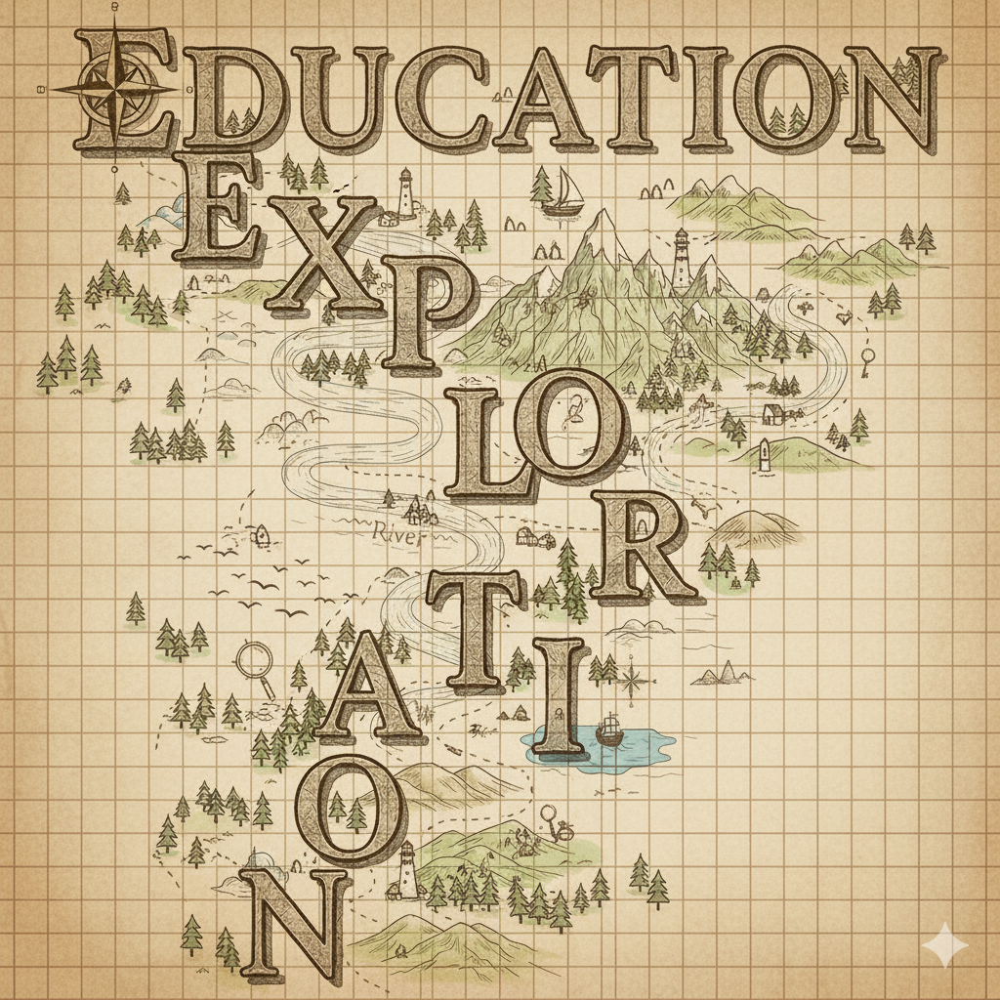

# 🌟 MTC x Education Exploration

<div align="center">



**Building Tomorrow's Tech Leaders Through Community & Faith**

*Empowering our Ummah to innovate, collaborate, and excel in technology* ⚡

[](#-join-our-community)
[](#-current-focus-areas)
[](#-our-mission)

</div>

---

## 🎯 Our Mission

**Education Exploration** was created to inspire individuals to build on their own initiative while motivating others to do the same. We firmly believe that **community is the strongest catalyst for advancing in technology** - and what better way to achieve this than by sharing knowledge with our Ummah.

### 🌟 Core Values

- 🚀 **Innovation Through Inspiration** - Encouraging independent building and creativity
- 🤝 **Community-Driven Growth** - Learning and teaching within our Ummah
- 💪 **Collective Strengthening** - Building stronger abilities through collaboration
- 🏆 **Healthy Competition** - Fostering excellence and potential team formation

---

## 🎓 What We Offer

This initiative serves multiple purposes for our tech community:

### 📚 **For Beginners**
- **Getting Started Resources** - Help newcomers begin their development journey
- **Mentorship Opportunities** - Connect with experienced community members
- **Structured Learning Paths** - Clear roadmaps for different tech disciplines

### 👥 **For Everyone**
- **Knowledge Sharing Platform** - Teach and learn from fellow community members
- **Project Showcase** - Display your work and get inspired by others
- **Collaboration Hub** - Find teammates for exciting projects
- **Skill Development** - Strengthen abilities through community interaction

---

## 🔬 Current Focus Areas

We're currently concentrating on **Computer Science & Computer Engineering** with plans to expand soon:

<div align="center">

| 🧠 **AI & Machine Learning** | 🖥️ **Operating Systems** | 🗄️ **Databases** |
|:---:|:---:|:---:|
| Neural Networks, ML Models | Kernel Development, System Programming | SQL, NoSQL, Database Design |

| 🌐 **Networking** | 💻 **Web Development** | 🏗️ **System Design** |
|:---:|:---:|:---:|
| Protocols, Network Programming | Frontend, Backend, Full-Stack | Architecture, Scalability, Design Patterns |

</div>

> 🚀 **More categories coming soon!** We're expanding into additional engineering fields based on community interest.

---

## 📁 Repository Structure

### 🗂️ **Project Organization**
```
MTC-Education-Exploration/
├── 🤝 Contributors/          # Community member profiles
├── 🧠 AI/                   # Artificial Intelligence projects
├── 🖥️ Operating-Systems/    # OS development projects
├── 🗄️ Databases/            # Database-related projects
├── 🌐 Networking/           # Network programming projects
├── 💻 Web-Development/      # Web dev projects
└── 🏗️ System-Design/        # System architecture projects
```

### 📋 **How to Contribute**

1. **🔨 Build** your project in your own repository
2. **📝 Create** a folder with your project name in the relevant category
3. **🔗 Add** your repository link and project details
4. **📖 Include** a README with:
   - Project description
   - Technologies used
   - Contributors
   - How to run/use the project

---

## 👥 Join Our Community

### 🌟 **Browse Contributors**
Visit our **[Contributors folder](./Contributors/)** to:
- 👀 **Discover** what community members are working on
- 🤝 **Connect** with like-minded developers
- 💡 **Get inspired** by amazing projects
- 🎯 **Find collaboration opportunities**

### 🚀 **Ready to Contribute?**
1. **Fork** this repository
2. **Create** your contributor profile in the Contributors folder
3. **Add** your projects to relevant categories
4. **Submit** a pull request
5. **Join** our growing community!

---

## 🎨 Project Submission Guidelines

### ✅ **What to Include:**
- 📂 **Folder Name:** `ProjectName-YourUsername`
- 📖 **README.md** with project details
- 🔗 **Repository Link** to your actual project
- 👥 **Contributor Information**
- 🛠️ **Tech Stack** and setup instructions

### 📝 **README Template:**
```markdown
# Project Name

## Description
Brief description of what your project does

## Technologies Used
- Technology 1
- Technology 2

## Contributors
- Your Name (@YourGitHub)

## Repository Link
[Project Repository](your-repo-link)

## How to Run
Step-by-step instructions
```

---

<div align="center">

## 🚀 Ready to Start Building?

**Join our community of passionate developers and let's create something amazing together!**

### 🌟 Quick Links

[](./Contributors/)
[](#-join-our-community)
[](#-current-focus-areas)

---

**Together, we're not just building software - we're building a stronger Ummah** 🤲

</div>